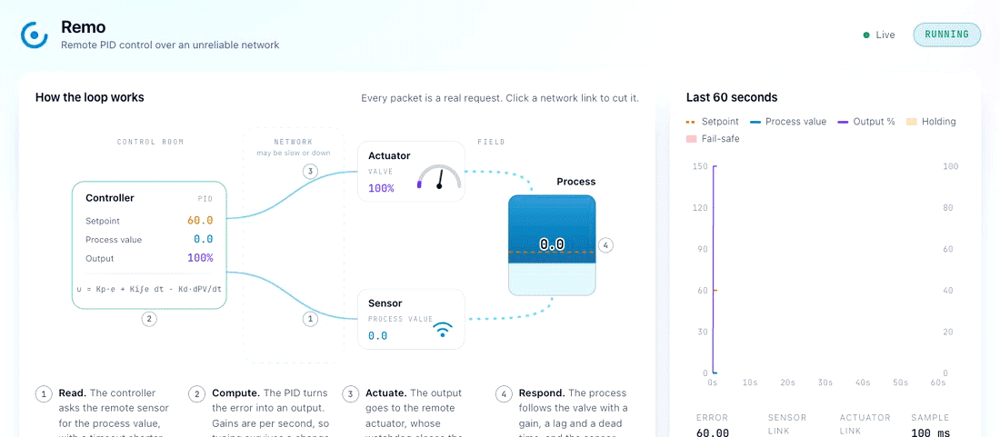
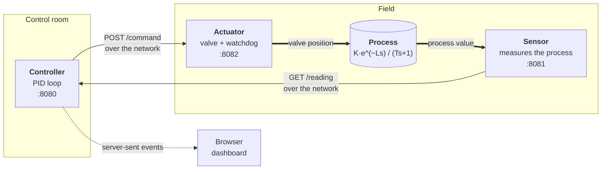
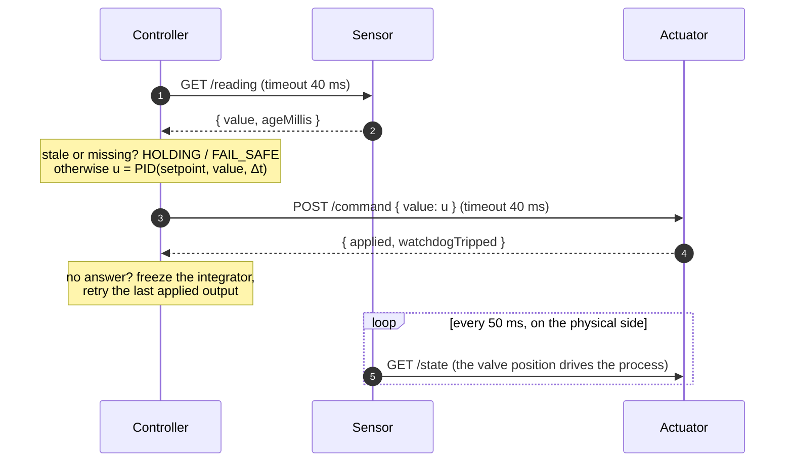
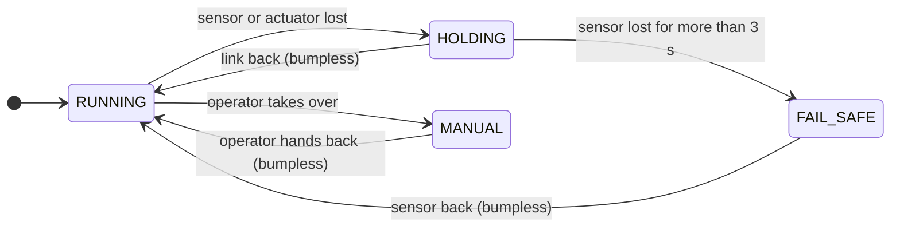
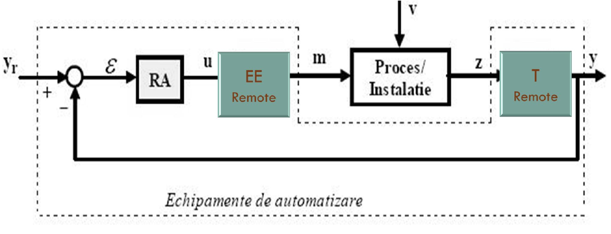
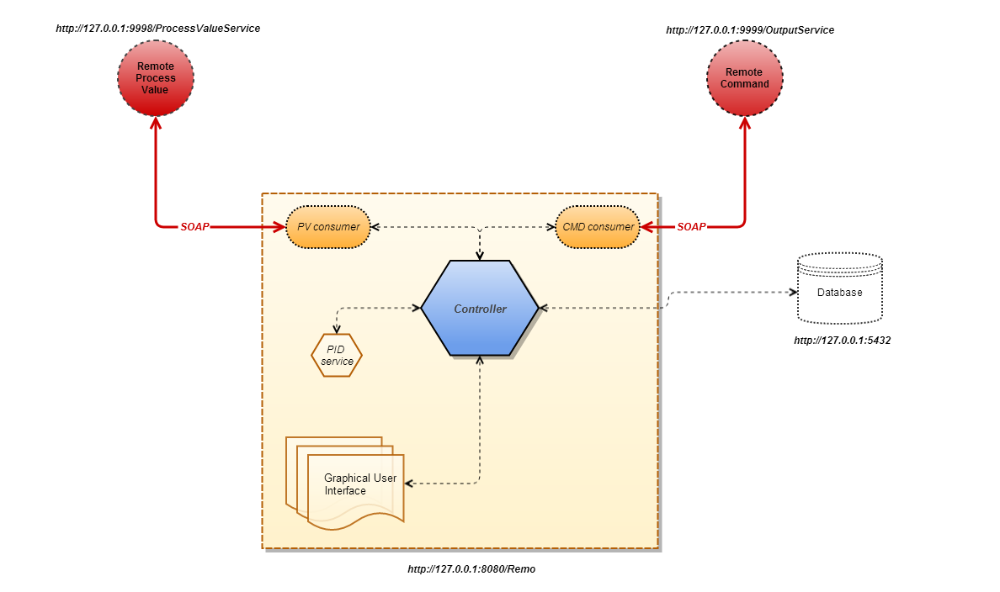
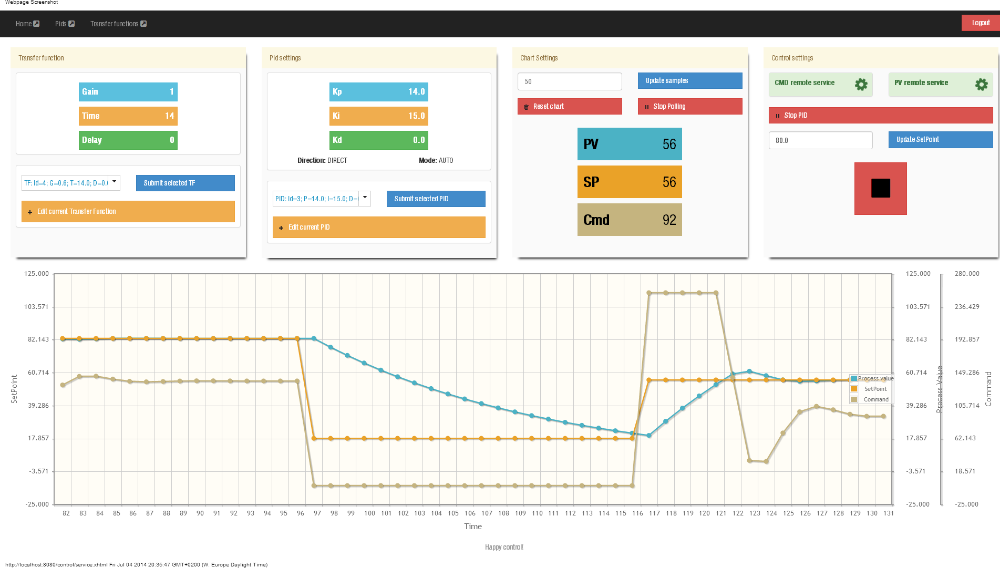

<div align="center">

# Remo

**Closing a control loop across a network that can fail.**

The controller, the sensor and the actuator of a PID loop run as three separate services. The loop keeps control while the network between them is healthy, and fails safe when it isn't.

[](https://github.com/ioanlucut/remo/actions/workflows/ci.yml)


[](LICENSE)



</div>

_Remo_ stands for **remote**. It began as my master's dissertation, [_Remote Control_](#from-the-2014-thesis) (Technical University of Cluj-Napoca, 2014), and was rebuilt from scratch in 2026.

## What Remo solves

Remo answers one question: **how do you run a feedback loop when the sensor and the actuator are somewhere else, and the network between them can't be trusted?**

1. **It distributes the loop.**
   - Every element of the loop is an independent service with a small HTTP contract: the controller, the actuator (the thesis's _execution element_) and the sensor (the _transducer_).
   - The controller can run next to the process or far from it, the split the thesis proposed: _"controller located locally or remotely; actuator remote; transducer remote"_.
2. **It controls any process, tuned while running.** Any process described by a gain, a lag and a dead time can be controlled. The setpoint, the PID gains, the direction, the mode and the process itself all change live. This is the thesis's aim of a _"generic implementation of process control, made concrete by setting (even in real time) the transfer function and the PID"_.
3. **It survives the network.**
   - Every call has a deadline, and stale or missing readings never reach the PID.
   - A lost sensor leads to holding the last output, then to a safe output, then to a smooth return.
   - A lost actuator freezes the integral term, so it can't build up while the output isn't taking effect.
4. **It fails safe at both ends.** The controller moves to a safe output when it goes blind. The actuator has its own watchdog, so the valve closes even if the controller disappears entirely.
5. **It makes all of this visible and testable.**
   - Every network link can be cut, slowed down or made lossy at runtime.
   - A live dashboard shows each request as it happens.
   - Automated tests prove each fault path, including over real sockets.

### Where this applies

- **Telecontrol.** Pumping stations, substations and pumped-storage plants have long been operated from a central control room over telemetry links. This was the thesis's starting point.
- **Distributed control systems and Industrial IoT.** Here the controller increasingly runs on an edge box or in the cloud, away from the equipment.
- **Teaching networked control.** The dashboard shows what a lost packet, a late answer or a dead link does to a real loop, and what a good fault policy does about it.

**Scope.** The process is simulated, and Remo is a reference design, not a certified safety system. The services have no authentication or TLS, by design, to keep the example small, so run them only on a trusted network.

## The problem

A textbook control loop assumes the controller, the sensor and the actuator are wired together. Once a network sits between them, the loop inherits the network's faults: latency, dropped messages, and links that simply go away. The 2014 thesis saw this first-hand when it cut its remote command service: _"if the command doesn't rise, the measured value doesn't rise."_

A naive loop fails in dangerous ways when that happens:

| Failure | Naive loop | Consequence |
|---|---|---|
| The sensor doesn't answer | Treats the missing reading as `0` | The error equals the full setpoint, so the controller opens the valve fully |
| The actuator doesn't answer | Keeps integrating the error | The integral winds up; when the link returns, the output slams to the limit |
| A reply arrives late | Waits for it | The sample period stretches, and the tuning no longer matches reality |
| The controller dies | Nothing on the field side reacts | The valve stays wherever it was last put |

The 2014 version had the first of these bugs. The rebuild handles all four.

## How Remo handles each failure

- **Every remote call has a deadline.** Each call must answer within 40% of the sample period (40 ms at the default 100 ms). A slow answer counts as a lost one, so a sample never overruns.
- **A missing reading is never treated as data.** The PID only sees fresh readings. The sensor reports the age of its value, and a stale value counts as missing.
- **A sensor loss is handled in stages.**
  1. `HOLDING`: keep the last output that was applied.
  2. `FAIL_SAFE`: if the sensor stays lost for 3 s, move to the configured safe output.
  3. Recovery: re-initialise the PID from the output in effect, so control resumes without a bump.
- **No windup while the actuator is unreachable.** The controller stops integrating and keeps retrying the last output that was actually applied.
- **The field side protects itself.** The actuator has a watchdog: if commands stop for 1 s, it closes the valve on its own. It doesn't depend on the controller being reachable to fail safely.
- **Tuning doesn't depend on the sample rate.**
  - Gains are per second, and each step uses the time that actually elapsed.
  - The derivative acts on the measurement, so a setpoint change causes no derivative kick.
  - The integral is clamped to the output range (anti-windup).
- **The simulated process behaves like a physical one.**
  - First order with dead time, discretised exactly.
  - It runs on its own clock in the sensor service.
  - It is driven by the valve position the actuator actually applied, not by what the controller hoped for.
- **Faults are built in.** Any network link can be cut, slowed down or made lossy at runtime, from the dashboard or the API.

## Architecture



Each service is a plain Java class on the JDK's built-in HTTP server with virtual threads. The only library is Jackson, for JSON. The three services can run in one JVM or on three machines.

### One control step



### Loop states



## The control theory

**PID controller** ([`PidController`](src/main/java/org/ilu/remo/control/PidController.java)). This is the positional form. $\sigma = +1$ for direct acting and $-1$ for reverse acting (e.g. cooling). $\Delta t_k$ is the measured time since the previous step:

$$e_k = \sigma\,(SP - PV_k)$$

$$I_k = \mathrm{clamp}\big(I_{k-1} + K_i\,e_k\,\Delta t_k\big)$$

$$u_k = \mathrm{clamp}\Big(K_p\,e_k + I_k - \sigma\,K_d\,\frac{PV_k - PV_{k-1}}{\Delta t_k}\Big)$$

- A bumpless transfer sets $I := u$ and $PV_{k-1} := PV_k$, so the next step continues from the current output.
- The defaults ($K_p = 2.5$, $K_i = 0.3\,\mathrm{s^{-1}}$) follow [Skogestad's SIMC rule](https://doi.org/10.1016/S0959-1524(02)00062-8) for the default process.

**Process** ([`FirstOrderPlant`](src/main/java/org/ilu/remo/plant/FirstOrderPlant.java)). This is first order with dead time, with gain $K$, lag $T$ and dead time $L$. It is discretised exactly for a zero-order-hold input with step $\Delta t$:

$$G(s) = \frac{K\,e^{-Ls}}{Ts + 1} \qquad\Longrightarrow\qquad y_{k+1} = a\,y_k + K(1-a)\,u_{k-d},\quad a = e^{-\Delta t/T},\; d = \mathrm{round}(L/\Delta t)$$

The defaults are $K = 1.5$, $T = 8\,\mathrm{s}$ and $L = 1\,\mathrm{s}$: a slow process with a noticeable delay, like a heated tank.

## Quick start

You need JDK 21 and Maven.

```bash
mvn package
java -jar target/remo.jar
```

Open **http://localhost:8080**. Then:

- **Cut the sensor link.** Click the lower network link in the diagram. Watch the controller hold its output, go fail-safe after 3 s, and resume without a bump when you click again.
- **Cut the actuator link.** Click the upper link. The actuator's own watchdog closes the valve and the process drops.
- **Slow the network.** Add 60 ms of latency. Answers now miss the 40 ms deadline and count as lost.
- **Change the process.** Raise the dead time to 4 s. The same gains now oscillate; retune to Kp 1 and Ki 0.1.
- **Watch it run on its own.** Turn on demo mode to get a new setpoint every 20 s.

### Running the services separately

Each service can run as its own process, for example on different machines:

```bash
java -jar target/remo.jar actuator
REMO_ACTUATOR_URL=http://field-box:8082/ java -jar target/remo.jar sensor
REMO_SENSOR_URL=http://field-box:8081/ REMO_ACTUATOR_URL=http://field-box:8082/ java -jar target/remo.jar controller
```

| Variable                                                           | Default                    |
| ------------------------------------------------------------------ | -------------------------- |
| `REMO_CONTROLLER_PORT` / `REMO_SENSOR_PORT` / `REMO_ACTUATOR_PORT` | `8080` / `8081` / `8082`   |
| `REMO_SENSOR_URL` / `REMO_ACTUATOR_URL`                            | `http://localhost:<port>/` |

## HTTP API

| Service             | Endpoint                                                                 | Purpose                                                                |
| ------------------- | ------------------------------------------------------------------------ | ---------------------------------------------------------------------- |
| Controller          | `GET /` · `GET /events`                                                  | Dashboard and live samples (server-sent events)                        |
|                     | `GET`, `POST /api/settings`                                              | Setpoint, gains, direction, auto/manual, demo mode; partial updates    |
|                     | `GET /api/history`                                                       | The last 60 s of samples                                               |
|                     | `GET`, `POST /api/sensor/faults` · `/api/actuator/faults` · `/api/plant` | Forwarded to the field services                                        |
| Sensor              | `GET /reading`                                                           | `{ value, ageMillis }`, behind fault injection                         |
|                     | `GET`, `POST /plant`                                                     | `{ gain, timeConstantSeconds, deadTimeSeconds }`                       |
| Actuator            | `POST /command`                                                          | `{ value }`, behind fault injection; feeds the watchdog                |
|                     | `GET /state`                                                             | `{ applied, watchdogTripped }`, the position the process actually sees |
| Sensor and actuator | `GET`, `POST /faults`                                                    | `{ down, latencyMillis, dropRate }`                                    |

```bash
curl -s localhost:8080/api/settings -d '{"setpoint": 90, "kp": 2}'
curl -s localhost:8080/api/sensor/faults -d '{"down": true}'
```

## Project layout

```
src/main/java/org/ilu/remo/
├── Remo.java                       launcher: all services, or one by name
├── control/
│   ├── PidController.java          the PID, pure and unit-tested
│   └── ControlLoop.java            fault policy: hold, fail-safe, bumpless recovery
├── plant/FirstOrderPlant.java      the simulated process
├── sensor/SensorService.java       runs the process and answers readings
├── actuator/ActuatorService.java   valve with a watchdog
├── controller/                     runs the loop, streams samples, serves the dashboard
└── http/                           JSON over the JDK HTTP server, fault injection
src/main/resources/web/             the dashboard: one HTML page, plain JS and CSS
```

## Tests

`mvn verify` runs 25 tests in a few seconds:

- **[`PidControllerTest`](src/test/java/org/ilu/remo/control/PidControllerTest.java)** checks the PID itself:
  - gain arithmetic;
  - independence from the sample rate;
  - anti-windup;
  - reverse action;
  - no derivative kick;
  - bumpless transfer.
- **[`FirstOrderPlantTest`](src/test/java/org/ilu/remo/plant/FirstOrderPlantTest.java)** checks the process model: 63.2% of the step at one time constant, the steady-state gain, the dead time, and parameter validation.
- **[`ControlLoopTest`](src/test/java/org/ilu/remo/control/ControlLoopTest.java)** covers every fault path against an in-memory process with a clock the test controls:
  - settling on the setpoint;
  - hold instead of reading zero;
  - fail-safe;
  - stale readings;
  - bumpless recovery;
  - no windup while the actuator is lost;
  - manual mode.
- **[`RemoEndToEndTest`](src/test/java/org/ilu/remo/RemoEndToEndTest.java)** starts all three services on real sockets. It closes the loop, cuts the sensor link through the API, checks the fail-safe and the recovery, and checks the event stream.

## From the 2014 thesis

<table>
<tr>
<td width="50%"></td>
<td width="50%"></td>
</tr>
<tr>
<td><sub>The idea: take the classic loop and make the actuator (EE) and the transducer (T) remote.</sub></td>
<td><sub>The 2014 architecture: SOAP services for the process value and the command.</sub></td>
</tr>
</table>

**Remote Control** (_Control de la distanță_), a master's dissertation by Ioan-Laurențiu Lucuț.

- **Institution:** Technical University of Cluj-Napoca, Faculty of Automation and Computer Science, Automation Department.
- **Supervisor:** Conf. Dr. Ing. Eva Dulf.
- **Defended:** 17 September 2014.

The thesis set out to _"control remote (distributed) processes with the help of web services, by distributing the elements of the control loop"_. It aimed to be _generic_: any process with a transfer function could be controlled by a PID whose parameters change at runtime. It was built with Java 7 SOAP services (JAX-WS), a JSF and PrimeFaces web app, Apache Shiro and PostgreSQL. The loop worked, and the thesis showed it with step responses and simulated connection losses.



The original code is preserved at the [`thesis-2014`](https://github.com/ioanlucut/remo/tree/thesis-2014) tag. Rebuilding it meant revisiting its decisions with twelve more years of experience:

|                         | 2014 thesis                                                                                 | 2026 rebuild                                                                    |
| ----------------------- | ------------------------------------------------------------------------------------------- | ------------------------------------------------------------------------------- |
| Transport               | SOAP/WSDL (JAX-WS), generated clients                                                       | JSON over HTTP on the JDK's own server                                          |
| Lost sensor or actuator | Value taken as `0`; the PID keeps running on it                                             | Hold, then fail-safe; integrator frozen; bumpless recovery                      |
| Actuator                | Stub that always acknowledged                                                               | Valve with a watchdog that fails safe on its own                                |
| Process                 | Simulated inside the sensor from state sent by the controller; dead time stored but ignored | Runs on its own clock, driven by the real valve position; dead time implemented |
| Tuning                  | Gains tied to a 1 s sample; scaling applied in some code paths but not others               | Gains per second, scaled by the measured Δt                                     |
| Stack                   | JSF, PrimeFaces, CDI, Hibernate, Shiro, PostgreSQL, Tomcat                                  | One jar, one direct dependency (Jackson)                                        |
| Tests                   | Integration tests that needed running services                                              | 25 automated tests and CI                                                       |
| Java                    | 7                                                                                           | 21 (records, virtual threads)                                                   |

## Acknowledgements

- Conf. Dr. Ing. **Eva Dulf**, who supervised the original thesis.
- Brett Beauregard's [_Improving the Beginner's PID_](http://brettbeauregard.com/blog/2011/04/improving-the-beginners-pid-introduction/) series, which shaped the 2014 PID. The rebuild keeps its best ideas: derivative on measurement, clamped integral and bumpless transfer.
- Sigurd Skogestad, [_Simple analytic rules for model reduction and PID controller tuning_](https://doi.org/10.1016/S0959-1524(02)00062-8) (2003), for the default tuning.

## Contributing

Issues and pull requests are welcome, especially new process models, other fault policies, or adapters for real sensors and actuators. `mvn verify` must pass.

## License

[MIT](LICENSE) © 2014–2026 Ioan Lucuț
